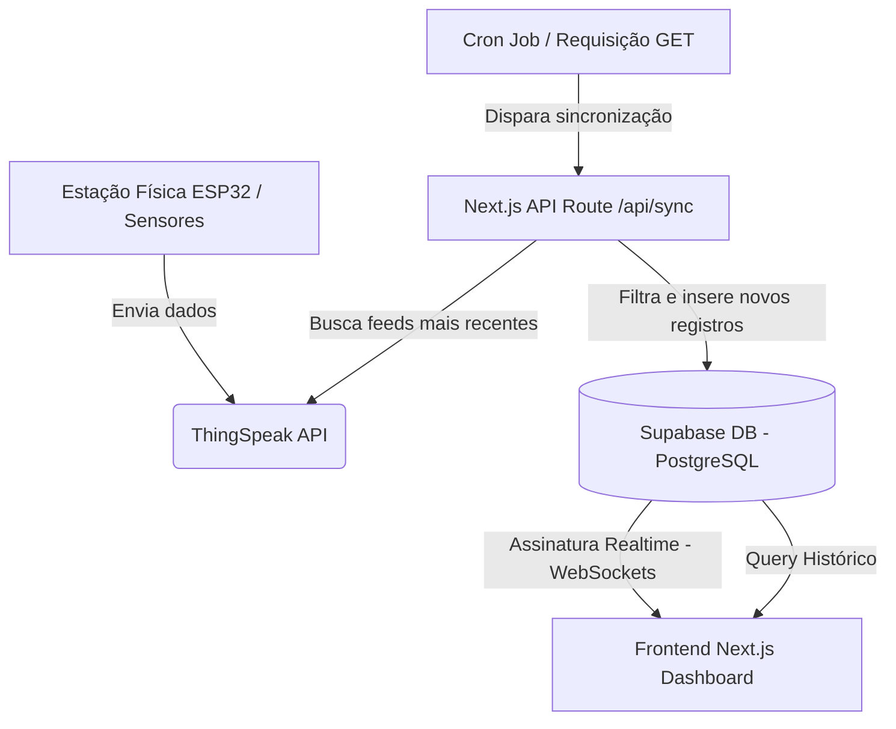

# 🌦️ Estação Meteorológica - E.M. Pe. Tomaz Ghirardelli

Este é o repositório da aplicação web para a **Estação Meteorológica** instalada na Escola Municipal Padre Tomaz Ghirardelli (Campo Grande - MS). O sistema foi desenvolvido com o objetivo de monitorar, registrar e analisar dados climáticos e de qualidade do ar em tempo real, integrando hardware (sensores) e software (banco de dados e dashboard interativo).

---

## 👥 Sobre o Projeto e Equipe

O projeto foi inteiramente idealizado e desenvolvido pela turma **1711** do curso de **Tecnologia em Sistemas para Internet** do **IFMS (Instituto Federal de Educação, Ciência e Tecnologia de Mato Grosso do Sul) - Campus Campo Grande**.

*   **Coordenador do Projeto:**
    *   Leonardo Lachi Manetti
*   **Professores Orientadores:**
    *   Jonathas Leontino Medina
    *   Eder de Souza Rodrigues
*   **Estudantes Desenvolvedores:**
    *   Gabriel Hideki Maekawa
    *   Luís César Ramires Bezerra
    *   Fillipe Coppes Furtado
    *   Isaque Melo de Paula
    *   João Pedro Fachineli Brito
    *   Pedro Henrique Pereira de Matos
    *   Marcos da Rosa Sotomaior
    *   Vitor Hugo Ferreira Menoni

---

## 🏗️ Arquitetura do Sistema

A arquitetura do projeto conecta de forma robusta e otimizada os dados coletados na estação física até a tela do usuário final:



1.  **Hardware & Telemetria:** A estação meteorológica física coleta leituras de múltiplos sensores e envia as informações periodicamente para o **ThingSpeak**.
2.  **Sincronização de Dados (`/api/sync`):** Uma rota dinâmica no Next.js consome a API do ThingSpeak, parseia os campos numéricos e realiza um *upsert* seguro no **Supabase** ignorando registros duplicados com base no ID de entrada (`entry_id`).
3.  **Visualização em Tempo Real:** O dashboard frontend escuta eventos do PostgreSQL via canal de tempo real (WebSockets do Supabase) exibindo novos dados instantaneamente, sem necessidade de atualizar a página.

---

## 📊 Métricas Monitoradas

O painel exibe e monitora as seguintes métricas climáticas e ambientais:

| Métrica | Sensor | Unidade | Descrição |
| :--- | :---: | :---: | :--- |
| **Temperatura** | DHT22 / BMP280 | °C | Temperatura ambiente em graus Celsius |
| **Umidade** | DHT22 | % | Umidade relativa do ar |
| **Pressão Atmosférica** | BMP280 | hPa | Pressão barométrica local |
| **Chuva Diária** | Pluviômetro | mm | Volume de precipitação acumulado no dia |
| **Gás Poluente** | MQ135 | ppm | Presença de gases poluentes (amônia, benzeno, fumaça, CO2) |
| **Gás Combustível** | MQ02 | ppm | Presença de gases combustíveis ou inflamáveis (GLP, propano, metano) |

---

## ✨ Funcionalidades Principais

*   **⚡ Atualizações em Tempo Real:** Conexão direta com os WebSockets do Supabase para refletir novos dados inseridos imediatamente.
*   **📈 Gráficos Históricos Interativos:** Visualização detalhada das leituras por meio de gráficos de linha responsivos gerados com **Recharts**.
*   **🔍 Zoom e Navegação por Scroll/Brush:** É possível utilizar a roda do mouse (scroll wheel) diretamente sobre o contêiner de gráficos para dar zoom no tempo ou utilizar o componente de *brush* sincronizado na linha do tempo para navegar por períodos específicos.
*   **📅 Filtro Temporal Flexível:** Exibição rápida das últimas 24 horas ou seleção personalizada de datas por meio de calendário integrado.
*   **☀️/🌙 Modo Escuro (Dark Mode):** Alternador de tema elegante e responsivo que respeita a preferência do sistema e armazena a escolha do usuário no `localStorage`.
*   **🌅 Horário de Nascer/Pôr do Sol:** Integração com API externa baseada nas coordenadas geográficas da escola no município de Campo Grande - MS para exibir a duração estimada do dia.

---

## 🛠️ Stack Tecnológica

*   **Framework Web:** [Next.js 16 (App Router)](https://nextjs.org/)
*   **Biblioteca de UI:** [React 19](https://react.dev/)
*   **Estilização:** [Tailwind CSS 4](https://tailwindcss.com/)
*   **Banco de Dados:** [Supabase (PostgreSQL)](https://supabase.com/)
*   **Gráficos:** [Recharts 3](https://recharts.org/)
*   **Ícones:** [Lucide React](https://lucide.dev/)

---

## ⚙️ Configuração do Ambiente

Crie um arquivo `.env.local` na raiz do projeto com as seguintes variáveis de ambiente obtidas no Supabase e no ThingSpeak:

```env
# URL e Chave Pública do Supabase (Acesso no Frontend)
NEXT_PUBLIC_SUPABASE_URL=https://seu-projeto.supabase.co
NEXT_PUBLIC_SUPABASE_ANON_KEY=sua-chave-anonima-jwt

# Chave Admin para inserções seguras na rota de sincronização
SUPABASE_SERVICE_ROLE_KEY=sua-chave-service-role

# Identificador do Canal do ThingSpeak (Opcional - Valor Padrão: 3147539)
THINGSPEAK_CHANNEL_ID=seu-id-de-canal
```

### Estrutura do Banco de Dados (`dados_estacao`)

Para o correto funcionamento da sincronização e do dashboard, a tabela `dados_estacao` no Supabase deve possuir a seguinte estrutura:

```sql
create table public.dados_estacao (
  entry_id bigint primary key,               -- ID único gerado pelo ThingSpeak
  data_hora timestamp with time zone not null, -- Data e Hora da medição
  temperatura_c double precision,            -- Campo 1 do ThingSpeak
  umidade_pct double precision,              -- Campo 2 do ThingSpeak
  pressao_hpa double precision,              -- Campo 3 do ThingSpeak
  gas_mq135 double precision,                -- Campo 4 do ThingSpeak (Gás Poluente)
  gas_mq02 double precision,                 -- Campo 5 do ThingSpeak (Gás Combustível)
  chuva_diaria_mm double precision,          -- Campo 6 do ThingSpeak
  memoria double precision                   -- Campo 7 do ThingSpeak (Monitoramento do ESP32)
);

-- Ativar replicação em tempo real para esta tabela
alter publication supabase_realtime add table public.dados_estacao;
```

---

## 🚀 Como Executar Localmente

1.  **Clone o repositório:**
    ```bash
    git clone <url-do-repositorio>
    cd weather-station
    ```

2.  **Instale as dependências:**
    ```bash
    npm install
    ```

3.  **Execute o servidor de desenvolvimento:**
    ```bash
    npm run dev
    ```

4.  **Acesse o painel:**
    Abra [http://localhost:3000](http://localhost:3000) no seu navegador.

5.  **Testar Sincronização:**
    Para forçar o carregamento de novas leituras do ThingSpeak e salvá-las no Supabase, acesse a rota local:
    [http://localhost:3000/api/sync](http://localhost:3000/api/sync)
